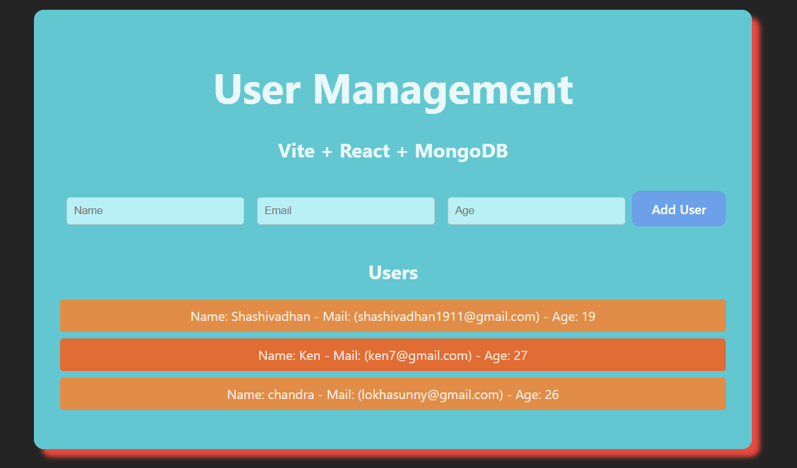

# React Express MongoDB - MERN Learning Project
# React + Vite + Express + MongoDB
A full-stack web application built with the MERN stack as part of my learning journey. This project demonstrates the integration of MongoDB, Express.js, React.js, and Node.js to create a modern web application.

## 🚀 Technologies Used

- **Frontend**: React.js
- **Backend**: Node.js, Express.js  
- **Database**: MongoDB
- **Additional Tools**: 
  - Mongoose (MongoDB object modeling)
  - Cors (Cross-origin resource sharing)
  - Body-parser (Parse incoming request bodies)

## 📸 Application Screenshots

### Form Interface & Application Output

*The main form interface showing the clean, user-friendly design with input fields for data entry. This demonstrates the React frontend component structure and styling.*
*Screenshot showing the application in action with form data being processed and displayed. This demonstrates the successful integration between the React frontend and Express backend.*

## 📋 Features

- Full CRUD operations (Create, Read, Update, Delete)
- RESTful API endpoints
- MongoDB database integration
- React frontend with component-based architecture
- Express.js server with middleware support
- Error handling and validation
- Clean and intuitive user interface
- Real-time data processing and display

## 🛠️ Installation & Setup

### Prerequisites
- Node.js (v14 or higher)
- MongoDB (local installation or MongoDB Atlas account)
- npm or yarn package manager

### Backend Setup
1. Navigate to the backend directory:
   ```bash
   cd backend
   ```

2. Install backend dependencies:
   ```bash
   npm install
   ```

3. Create a `.env` file in the backend directory and add your MongoDB connection string:
   ```env
   MONGODB_URI=mongodb://localhost:27017/your-database-name
   PORT=5000
   ```

4. Start the backend server:
   ```bash
   npm start
   # or for development with nodemon
   npm run dev
   ```

### Frontend Setup
1. Navigate to the frontend directory:
   ```bash
   cd frontend
   ```

2. Install frontend dependencies:
   ```bash
   npm install
   ```

3. Start the React development server:
   ```bash
   npm run dev
   ```

The application will run on:
- Frontend: http://localhost:5000
- Backend: http://localhost:5173

## 📁 Project Structure

```
Reactexpressmongo/
├── backend/
│   ├── models/          # MongoDB schemas
│   ├── routes/          # API routes
│   ├── middleware/      # Custom middleware
│   ├── config/          # Database configuration
│   └── server.js        # Main server file
├── frontend/
│   ├── public/          # Public assets
│   ├── src/
│   │   ├── components/  # React components
│   │   ├── pages/       # Page components
│   │   ├── services/    # API service calls
│   │   └── App.js       # Main App component
│   └── package.json
├── Form_output.png      # Application demo screenshot
├── Form_structure.png   # Form interface screenshot
└── README.md
```

## 🔄 API Endpoints

### Base URL: `http://localhost:5000/api`

| Method | Endpoint | Description |
|--------|----------|-------------|
| GET    | `/items` | Get all items |
| GET    | `/items/:id` | Get item by ID |
| POST   | `/items` | Create new item |
| PUT    | `/items/:id` | Update item by ID |
| DELETE | `/items/:id` | Delete item by ID |

## 🎯 How It Works

1. **Frontend (React)**: Users interact with the form interface shown in the screenshots above
2. **API Communication**: Form submissions trigger HTTP requests to the Express backend
3. **Backend Processing**: Express server processes requests and validates data
4. **Database Operations**: MongoDB stores and retrieves data using Mongoose ODM
5. **Response Handling**: Results are sent back to the frontend and displayed to users

## 🧪 Testing

Run the following commands to test the application:

```bash
# Test backend API endpoints
npm run test:backend

# Test frontend components
npm run test:frontend
```

## 📚 Learning Objectives

This project helped me understand:

- **MongoDB**: Document-based database operations, schema design with Mongoose
- **Express.js**: RESTful API development, middleware implementation, routing
- **React.js**: Component lifecycle, state management, props handling, hooks
- **Node.js**: Server-side JavaScript, package management with npm
- **Full-Stack Integration**: Connecting frontend and backend, API consumption
- **CRUD Operations**: Implementing Create, Read, Update, Delete functionality
- **Error Handling**: Both client-side and server-side error management
- **UI/UX Design**: Creating clean and intuitive user interfaces

## 🔧 Common Issues & Solutions

### MongoDB Connection Issues
- Ensure MongoDB is running locally or check your Atlas connection string
- Verify network access and authentication credentials

### CORS Errors
- Make sure CORS middleware is properly configured in Express
- Check that frontend is making requests to the correct backend URL

### Port Conflicts
- Change ports in configuration if default ports are occupied
- Ensure backend and frontend are running on different ports

## 📖 Resources Used

- [MongoDB Documentation](https://docs.mongodb.com/)
- [Express.js Guide](https://expressjs.com/)
- [React Documentation](https://react.dev/)
- [Node.js Documentation](https://nodejs.org/)
- [Mongoose Documentation](https://mongoosejs.com/)

## 🚧 Future Improvements

- [ ] Add user authentication and authorization
- [ ] Implement data validation and sanitization
- [ ] Add unit and integration tests
- [ ] Deploy to cloud platforms (Heroku, Netlify, MongoDB Atlas)
- [ ] Add responsive design and better UI/UX
- [ ] Implement caching and performance optimization
- [ ] Add more form fields and data types
- [ ] Implement search and filtering functionality

## 🤝 Contributing

This is a learning project, but suggestions and feedback are welcome! Feel free to:
1. Fork the project
2. Create a feature branch
3. Commit your changes
4. Push to the branch
5. Open a Pull Request

## 📄 License

This project is for educational purposes. Feel free to use it as a reference for your own learning journey.

---

**Note**: This project is part of my MERN stack learning journey. The code may not be production-ready and is intended for educational purposes.
