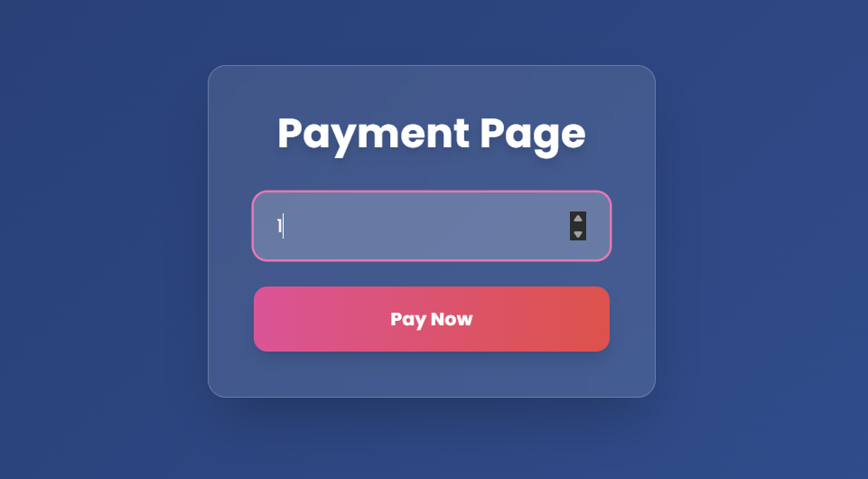
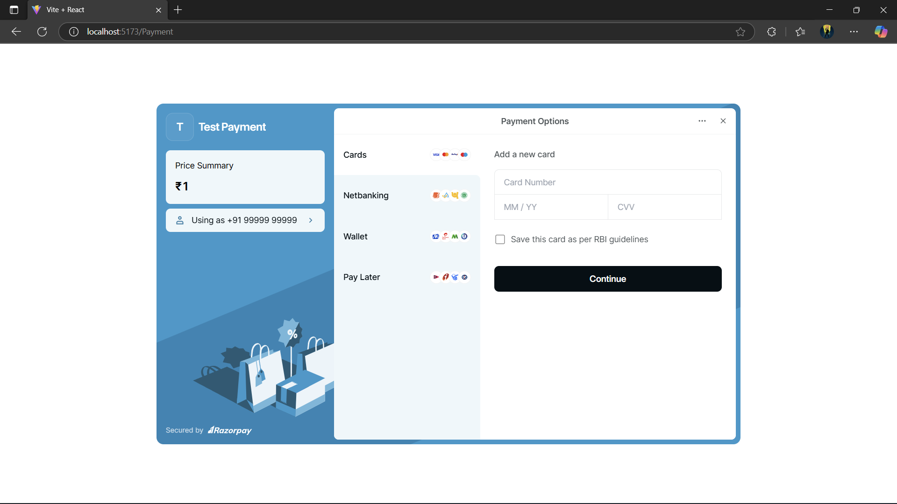
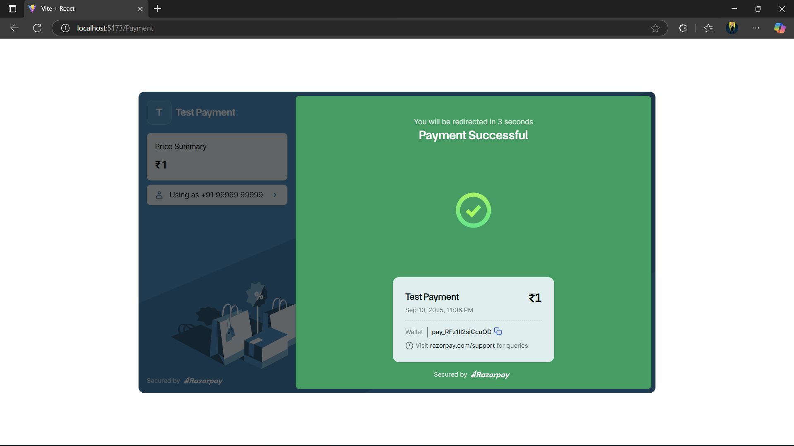

# Payment Gateway - MERN Stack

A modern, secure payment gateway built with the MERN stack, featuring multiple payment methods including cards, netbanking, wallets, and pay-later options. The application provides a seamless user experience with a beautiful UI and comprehensive payment processing capabilities.

## 🚀 Features

- **Multiple Payment Methods**
  - Credit/Debit Cards
  - Net Banking
  - Digital Wallets
  - Pay Later Options
- **Secure Payment Processing**
- **Real-time Payment Status Updates**
- **Responsive Design**
- **Transaction History**
- **Payment Confirmation & Receipts**
- **Modern Glass-morphism UI**

## 🛠️ Tech Stack

### Frontend
- **React.js** - UI Library
- **CSS3** - Styling with modern effects
- **JavaScript (ES6+)** - Programming Language
- **Axios** - HTTP Client

### Backend
- **Node.js** - Runtime Environment
- **Express.js** - Web Framework
- **MongoDB** - Database
- **Mongoose** - ODM

### Payment Integration
- **Razorpay** - Payment Gateway
- **Stripe** (Optional) - Alternative Payment Gateway

### Development Tools
- **Vite** - Build Tool
- **ESLint** - Code Linting
- **Prettier** - Code Formatting
- **Nodemon** - Development Server

## 📸 Application Screenshots

### Form Interface & Application Output
<div align="center">
  
  
</div>
<div align="center">
  
  
</div>

## 🚀 Quick Start

### Prerequisites

Make sure you have the following installed:
- **Node.js** (v18 or higher)
- **npm** or **yarn**
- **MongoDB** (local or Atlas)
- **Razorpay Account** (for payment processing)

### Installation

1. **Clone the repository**

2. **Install dependencies**
```bash
# Install root dependencies
npm install

# Install client dependencies
cd client
npm install

# Install server dependencies
cd ../server
npm install
```

3. **Environment Setup**

Create `.env` files in both client and server directories:

**Server `.env`:**
```env
# Database
MONGODB_URL

# Server Configuration
PORT=5000
NODE_ENV=development

# JWT Secret
JWT_SECRET=your-super-secret-jwt-key

# Razorpay Configuration
RAZORPAY_KEY_ID=your_razorpay_key_id
RAZORPAY_KEY_SECRET=your_razorpay_key_secret

# CORS
CLIENT_URL=http://localhost:5173

# Email Configuration (Optional)
EMAIL_USER=your-email@gmail.com
EMAIL_PASS=your-app-password
```

**Client `.env`:**
```env
VITE_API_URL=http://localhost:5000/api
VITE_RAZORPAY_KEY_ID=your_razorpay_key_id
```

4. **Start the application**

Option 1 - Start both servers concurrently (from root directory):
```bash
npm run dev
```

Option 2 - Start servers separately:
```bash
# Terminal 1 - Start backend server
cd server
npm run dev

# Terminal 2 - Start frontend server
cd client
npm run dev
```

The application will be available at:
- **Frontend:** http://localhost:5173
- **Backend:** http://localhost:5000

## 🔧 Configuration

### Payment Gateway Setup

1. **Create Razorpay Account**
   - Sign up at [Razorpay Dashboard](https://dashboard.razorpay.com/)
   - Get your API keys from the dashboard
   - Add keys to your environment variables

2. **Database Setup**
   - Install MongoDB locally or use MongoDB Atlas
   - Update the connection string in your `.env` file

### Environment Variables

| Variable | Description | Required |
|----------|-------------|----------|
| `MONGODB_URI` | MongoDB connection string | Yes |
| `PORT` | Server port number | No (default: 5000) |
| `JWT_SECRET` | Secret key for JWT tokens | Yes |
| `RAZORPAY_KEY_ID` | Razorpay API Key ID | Yes |
| `RAZORPAY_KEY_SECRET` | Razorpay API Key Secret | Yes |
| `CLIENT_URL` | Frontend URL for CORS | Yes |

## 📚 API Documentation

### Payment Routes

#### Create Payment Order
```http
POST /api/payments/create-order
Content-Type: application/json

{
  "amount": 100,
  "currency": "INR",
  "receipt": "order_123"
}
```

#### Verify Payment
```http
POST /api/payments/verify
Content-Type: application/json

{
  "razorpay_order_id": "order_xyz",
  "razorpay_payment_id": "pay_abc",
  "razorpay_signature": "signature_123"
}
```

#### Get Payment Status
```http
GET /api/payments/status/:paymentId
```

### Transaction Routes

#### Get All Transactions
```http
GET /api/transactions
```

#### Get Transaction by ID
```http
GET /api/transactions/:id
```


### Styling Features

- Modern glass-morphism design
- Responsive layout
- Smooth animations and transitions
- Professional color scheme
- Mobile-optimized interface

## 🔒 Security Features

- **Input Validation** - Server-side validation for all inputs
- **CORS Protection** - Configured for specific origins
- **Environment Variables** - Sensitive data protection
- **Payment Verification** - Webhook signature verification
- **HTTPS Ready** - SSL/TLS support for production

## 🚀 Deployment

### Frontend (Vercel/Netlify)

1. **Build the client**
```bash
cd client
npm run build
```

2. **Deploy to Vercel**
```bash
npm install -g vercel
vercel --prod
```

### Backend (Railway/Heroku)

1. **Prepare for deployment**
```bash
cd server
npm install --production
```

2. **Deploy to Railway**
- Connect your GitHub repository
- Set environment variables
- Deploy automatically

### Environment Setup for Production

Update your environment variables for production:
- Use production MongoDB URI
- Set `NODE_ENV=production`
- Update `CLIENT_URL` to your production frontend URL
- Use production Razorpay keys

## 🧪 Testing

### Run Tests
```bash
# Backend tests
cd express-new
npm test

# Frontend tests
cd vite-new
npm test
```

### Test Payment Flow

1. Use Razorpay test cards:
   - **Success:** 4111 1111 1111 1111
   - **Failure:** 4000 0000 0000 0002

## 📈 Performance Optimization

- **Code Splitting** - React lazy loading
- **Image Optimization** - Compressed assets
- **API Caching** - Redis integration (optional)
- **Database Indexing** - Optimized queries
- **Minification** - Production builds

## 🤝 Contributing

1. Fork the repository
2. Create your feature branch (`git checkout -b feature/amazing-feature`)
3. Commit your changes (`git commit -m 'Add some amazing feature'`)
4. Push to the branch (`git push origin feature/amazing-feature`)
5. Open a Pull Request


## 👥 Authors

- **SHASHIVADHAN CHEEPIRI** - *Initial work* - [Shashivadhan1911](https://github.com/Shashivadhan1911)

## 🙏 Acknowledgments

- Razorpay for payment processing
- React team for the amazing library
- MongoDB for the database solution
- All contributors and testers


---

**Happy Coding! 🎉**
